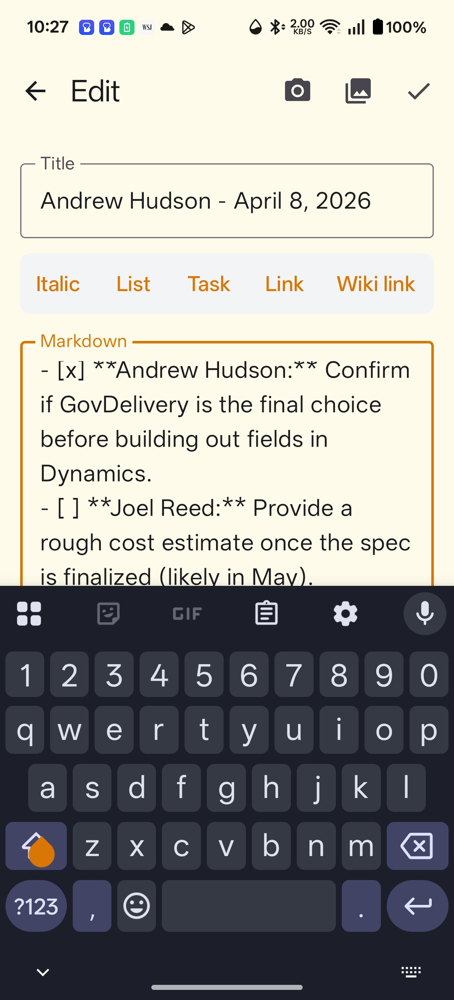

# Specular for Android and macOS

<p align="center">
  
</p>

Specular is a GMS-free, local-first Android app for Markdown notes. It keeps
your notes on the device and can synchronize them directly with a GitHub
repository that follows the [Reflect](https://github.com/team-reflect/reflect-open)
format—no custom server, Google Play Services, Firebase, or telemetry required.

## Features

- **Local-first Markdown notes.** Create, edit, rename, pin, archive, and delete
  notes while offline. Notes are stored locally before they are synchronized.
- **Reflect-compatible GitHub sync.** Pull and push Markdown notes and image
  attachments through the GitHub API. The app understands notes at the repository
  root, in `notes/`, and daily notes in `daily/`.
- **Safe conflict handling.** When a local edit conflicts with a remote update,
  Specular preserves the local version as a dated conflict copy instead of
  overwriting it.
- **Daily notes and global to-dos.** Open or create today's note in one tap,
  collect Markdown checklist items from across notes, and filter them by open,
  completed, or all.
- **Search and organization.** Search note titles and bodies, browse folders,
  sort notes, and use pinned notes for quick access.
- **Markdown with links and images.** Work with common Markdown, wiki links,
  checklists, and image attachments. Android supports camera and photo-library
  import; macOS uses the system file chooser. Attachments sync with the note
  that references them.
- **Voice capture (optional).** Record a thought, transcribe it with a configured
  OpenAI API key, and save it to today’s note, a to-do, or an existing note.
  Interrupted recordings can be recovered and retried.
- **AI summaries (optional).** Generate summaries through an OpenAI-compatible
  endpoint that you configure in Settings.
- **Platform integration.** Android includes the home-screen to-do widget;
  macOS adds a resizable desktop window, navigation rail, native menu bar, and
  keyboard shortcuts. Dark mode is included.

## Requirements

- Android 8.0 (API 26) or later
- macOS 11 or later for the desktop app
- [Flutter](https://docs.flutter.dev/get-started/install) with the Android toolchain
  configured
- CocoaPods on macOS (required by the current desktop plugins)
- Android device or emulator for installation
- A GitHub personal access token only if you want synchronization
- An OpenAI API key only for voice transcription; an OpenAI-compatible endpoint
  and key only for AI summaries

## Get started

### 1. Clone and prepare the project

```bash
git clone <repository-url>
cd specular
cd flutter_app
flutter pub get
cd ..
```

Check that Flutter can see an Android target:

```bash
flutter devices
```

### 2. Build and install a debug APK

From the repository root:

```bash
make install-debug
```

This builds `flutter_app/build/app/outputs/flutter-apk/app-debug.apk` and installs
it on the selected connected device. To build without installing, use:

```bash
make build-debug
```

`make build` and `make install` are short aliases for the debug targets.

### Build the macOS app

On a Mac with Xcode and Flutter's macOS toolchain installed, run from the
repository root:

```bash
make build-macos-debug
open flutter_app/build/macos/Build/Products/Debug/Specular.app
```

For a release build, use `make build-macos-release`. The app stores its own
local notes and Keychain credentials; it does not import Android-private data.
Connect the same GitHub repository from Settings to populate a desktop install.

### 3. Start taking notes

Open Specular and create a note, a to-do, or today’s daily note. The app works
locally without a GitHub account; your changes remain on the device until sync is
configured.

### 4. Back up with GitHub (optional)

Open **Settings** and choose **Create a private GitHub backup** to authorize
GitHub and create an initialized private repository. The app will upload the
notes already on your device. This guided flow needs a build configured with
Specular's GitHub OAuth client.

Technical users can instead enter a GitHub fine-grained personal access token
with **Contents: Read and write** access and choose an existing repository.
Empty repositories are supported; Specular adds notes on the first sync.

The first sync imports the remote notes. Thereafter, changes are pushed during
sync. Android requests background sync at the cadence selected in Settings (15
minutes to daily) when Android permits network work. On macOS, sync runs at
startup/resume and best-effort while Specular remains open; it never runs after
the app has quit. You can also pull to refresh from the note list.

For compatible repository layout and synchronization semantics, see the
[Reflect GitHub sync contract](docs/reflect-contract.md).

## Using Specular

### Notes and Markdown

Use the create button to make a note or a dedicated to-do. Choose a folder while
creating a regular note, then use the editor controls for emphasis, lists, tasks,
links, wiki links, and image attachments. In the note view you can pin, rename,
archive, or delete a note.

Specular treats the first `# ` heading as the note title and preserves the
Reflect-compatible front matter used to identify a note. Image files are saved in
`attachments/` and represented by standard Markdown image links.

### Tasks and daily notes

Markdown checkboxes (`- [ ]` and `- [x]`) are indexed as global to-dos. The
**To-dos** screen lets you complete items without manually opening their source
note, and the Android widget exposes the same task list from the home screen.

Use the calendar action to open today’s note. Voice capture can also append a
transcript or a to-do to it.

### Optional AI and voice services

In **Settings**, configure an OpenAI-compatible URL, API key, and model to enable
note summaries. Voice capture is configured separately with an OpenAI API key and
models for live transcription, recovery transcription, and optional cleanup.

These services are optional. Their credentials are stored using Android secure
storage and are sent only to the endpoint you configure when you request the
related feature.

## Development

Run these commands from `flutter_app/`:

```bash
flutter analyze
flutter test
```

Generate Drift database code after changing its annotated schema:

```bash
dart run build_runner build
```

Useful root-level commands:

```bash
make build-debug      # Build the debug APK
make install-debug    # Build and install it with adb
make build-macos-debug # Build the macOS debug app
make build-macos-release # Build the macOS release app
make clean            # Remove Flutter build artifacts
```

Project layout:

```text
flutter_app/
  lib/          Flutter UI, note database, Markdown, sync, AI, and voice flows
  android/      Native Android integration, to-do widget, and voice service
  macos/        Native macOS runner, sandbox permissions, and window setup
  test/         Flutter unit and widget tests
docs/
  reflect-contract.md  Reflect repository format and sync behavior
```

## Releases and updates

The debug build is intended for development and sideloading. Production releases
are signed locally: copy `flutter_app/android/key.properties.example` to
`flutter_app/android/key.properties` and set it to the appropriate keystore.
Keep the signing material out of version control.

Specular does not include an in-app auto-updater. Distribute signed APKs through
GitHub Releases or another trusted channel, then install updates over the existing
app to preserve its data.

## Privacy and data

- Specular has no Play Services, Firebase, or telemetry dependencies.
- Notes live in the app’s local storage and, when enabled, the GitHub repository
  you selected.
- A local-only library is not a device-recovery backup. In **Settings** you can
  export a portable `.zip` backup and restore it into an empty, disconnected
  Specular library.
- GitHub and AI credentials are stored in platform secure storage (Android
  secure storage or the macOS Keychain).
- Network access is used for GitHub sync and the optional AI/voice requests.

## Related documentation

- [Reflect GitHub sync contract](docs/reflect-contract.md) — repository layout,
  note format, attachments, and conflict behavior
- [GitHub sync guide](docs/SYNC.md) — token setup, sync behavior, and recovery
- [Android GitHub sync implementation plan](docs/plans/2026-08-06-android-github-sync.md)
  — implementation history and technical plan
- [macOS release guide](docs/macos-release.md) — signing, notarization, and
  direct-distribution checklist
